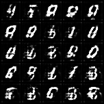
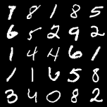
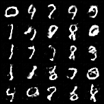
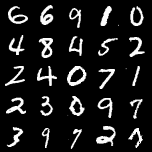
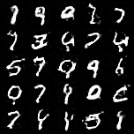
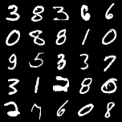

# Deep Convolutional GAN (DCGAN)

In this notebook, you're going to create another GAN using the MNIST dataset. You will implement a 
Deep Convolutional GAN (DCGAN), a very successful and influential GAN model developed in 2015.


# Configuration
You can modify the [parameters-setting](./train.py#L22-#L33) before training.

# Train
```shell
$ python train.py
```
The visualized images during training process will be saved at `./vis` dir by default.

# Visualization
|  step   |  fake   | real  |
|  :----:   |  :----:   | :----:    |
|2k iters|   |  |
|10k iters|   |  |
|20k iters|   |  |


